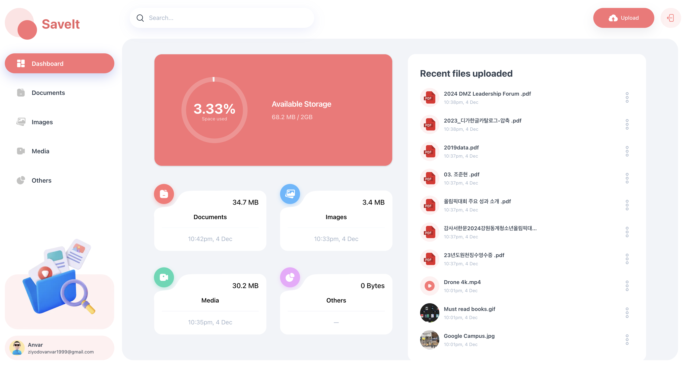

<div align="center">
 
<p align="center">
    <a href="01-home">
        
    </a>
</p>

 
  <div>
     
    
    
    
  </div>

<h3 align="center">Storage and File Sharing Platform</h3>

</div>

## 📋 <a name="table">Table of Contents</a>

1. 🤖 [Introduction](#introduction)
2. ⚙️ [Tech Stack](#tech-stack)
3. 🔋 [Features](#features)
4. 🤸 [Quick Start](#quick-start)
5. 🕸️ [Snippets (Code to Copy)](#snippets)
6. 🔗 [Assets](#links)


## <a name="introduction">🤖 Introduction</a>

A storage management and file sharing platform that lets users effortlessly upload, organize, and share files. Built with the latest Next.js 15 and the Appwrite Node SDK, utilizing advanced features for seamless file management.

If you're getting started and need assistance or face any bugs, join our active Discord community with over **34k+**
members. It's a place where people help each other out.

## <a name="tech-stack">⚙️ Tech Stack</a>

- React 19
- Next.js 15
- Appwrite
- TailwindCSS
- ShadCN
- TypeScript

## <a name="features">🔋 Features</a>

👉 **User Authentication with Appwrite**: Implement signup, login, and logout functionality using Appwrite's authentication system.

👉 **FIle Uploads**: Effortlessly upload a variety of file types, including documents, images, videos, and audio, ensuring all your important data.

👉 **View and Manage Files**: Users can browse through their uploaded files stored in Appwrite storage, view on a new tab, rename file or delete.

👉 **Download Files**: Users can download their uploaded files giving them instant access to essential documents.

👉 **File Sharing**: Users can easily share their uploaded files with others, enabling collaboration and easy access to important content.

👉 **Dashboard**: Gain insights at a glance with a dynamic dashboard that showcases total and consumed storage, recent uploads, and a summary of files grouped by type.

👉 **Global Search**: Users can quickly find files and shared content across the platform with a robust global search feature.

👉 **Sorting Options**: Organize files efficiently by sorting them by date, name, or size, making file management a breeze.

👉 **Modern Responsive Design**: A fresh and minimalist UI that emphasizes usability, ensuring a clean aesthetic across all devices.

and many more, including the latest **React 19**, **Next.js 15** and **Appwrite** features alongside code architecture and
reusability

## <a name="quick-start">🤸 Quick Start</a>

Follow these steps to set up the project locally on your machine.

**Prerequisites**

Make sure you have the following installed on your machine:

- [Git](https://git-scm.com/)
- [Node.js](https://nodejs.org/en)
- [npm](https://www.npmjs.com/) (Node Package Manager)

**Cloning the Repository**

```bash
git clone https://github.com/Mr-Perfectuz/SaveIt.git
cd SaveIt
```

**Installation**

Install the project dependencies using npm:

```bash
npm install
```

**Set Up Environment Variables**

Create a new file named `.env.local` in the root of your project and add the following content:

```env
NEXT_PUBLIC_APPWRITE_ENDPOINT="https://cloud.appwrite.io/v1"
NEXT_PUBLIC_APPWRITE_PROJECT=""
NEXT_PUBLIC_APPWRITE_DATABASE=""
NEXT_PUBLIC_APPWRITE_USERS_COLLECTION=""
NEXT_PUBLIC_APPWRITE_FILES_COLLECTION=""
NEXT_PUBLIC_APPWRITE_BUCKET=""
NEXT_APPWRITE_KEY=""
```

Replace the values with your actual Appwrite credentials. You can obtain these credentials by signing up &
creating a new project on the [Appwrite website](https://appwrite.io/).

**Running the Project**

```bash
npm run dev
```

Open [http://localhost:3000](http://localhost:3000) in your browser to view the project.

## <a name="snippets">🕸️ Snippets</a>

<details>
<summary><code>tailwind.config.ts</code></summary>

```typescript
import type { Config } from 'tailwindcss';

const config: Config = {
  darkMode: ['class'],
  content: [
    './pages/**/*.{js,ts,jsx,tsx,mdx}',
    './components/**/*.{js,ts,jsx,tsx,mdx}',
    './app/**/*.{js,ts,jsx,tsx,mdx}',
  ],
  theme: {
    extend: {
      colors: {
        brand: {
          DEFAULT: '#FA7275',
          100: '#EA6365',
        },
        red: '#FF7474',
        error: '#b80000',
        green: '#3DD9B3',
        blue: '#56B8FF',
        pink: '#EEA8FD',
        orange: '#F9AB72',
        light: {
          100: '#333F4E',
          200: '#A3B2C7',
          300: '#F2F5F9',
          400: '#F2F4F8',
        },
        dark: {
          100: '#04050C',
          200: '#131524',
        },
      },
      fontFamily: {
        poppins: ['var(--font-poppins)'],
      },
      boxShadow: {
        'drop-1': '0px 10px 30px 0px rgba(66, 71, 97, 0.1)',
        'drop-2': '0 8px 30px 0 rgba(65, 89, 214, 0.3)',
        'drop-3': '0 8px 30px 0 rgba(65, 89, 214, 0.1)',
      },
      borderRadius: {
        lg: 'var(--radius)',
        md: 'calc(var(--radius) - 2px)',
        sm: 'calc(var(--radius) - 4px)',
      },
      keyframes: {
        'caret-blink': {
          '0%,70%,100%': { opacity: '1' },
          '20%,50%': { opacity: '0' },
        },
      },
      animation: {
        'caret-blink': 'caret-blink 1.25s ease-out infinite',
      },
    },
  },
  plugins: [require('tailwindcss-animate')],
};
export default config;
```

</details>


<details>
<summary><code>constants/index.ts</code></summary>

```typescript
export const navItems = [
  {
    name: 'Dashboard',
    icon: '/assets/icons/dashboard.svg',
    url: '/',
  },
  {
    name: 'Documents',
    icon: '/assets/icons/documents.svg',
    url: '/documents',
  },
  {
    name: 'Images',
    icon: '/assets/icons/images.svg',
    url: '/images',
  },
  {
    name: 'Media',
    icon: '/assets/icons/video.svg',
    url: '/media',
  },
  {
    name: 'Others',
    icon: '/assets/icons/others.svg',
    url: '/others',
  },
];

export const actionsDropdownItems = [
  {
    label: 'Rename',
    icon: '/assets/icons/edit.svg',
    value: 'rename',
  },
  {
    label: 'Details',
    icon: '/assets/icons/info.svg',
    value: 'details',
  },
  {
    label: 'Share',
    icon: '/assets/icons/share.svg',
    value: 'share',
  },
  {
    label: 'Download',
    icon: '/assets/icons/download.svg',
    value: 'download',
  },
  {
    label: 'Delete',
    icon: '/assets/icons/delete.svg',
    value: 'delete',
  },
];

export const sortTypes = [
  {
    label: 'Date created (newest)',
    value: '$createdAt-desc',
  },
  {
    label: 'Created Date (oldest)',
    value: '$createdAt-asc',
  },
  {
    label: 'Name (A-Z)',
    value: 'name-asc',
  },
  {
    label: 'Name (Z-A)',
    value: 'name-desc',
  },
  {
    label: 'Size (Highest)',
    value: 'size-desc',
  },
  {
    label: 'Size (Lowest)',
    value: 'size-asc',
  },
];

export const MAX_FILE_SIZE = 50 * 1024 * 1024; // 50MB
```

</details>


<details>
<summary><code>index.d.ts</code></summary>

```ts
/* eslint-disable no-unused-vars */

declare type FileType = 'document' | 'image' | 'video' | 'audio' | 'other';

declare interface ActionType {
  label: string;
  icon: string;
  value: string;
}

declare interface SearchParamProps {
  params?: Promise<SegmentParams>;
  searchParams?: Promise<{ [key: string]: string | string[] | undefined }>;
}

declare interface UploadFileProps {
  file: File;
  ownerId: string;
  accountId: string;
  path: string;
}
declare interface GetFilesProps {
  types: FileType[];
  searchText?: string;
  sort?: string;
  limit?: number;
}
declare interface RenameFileProps {
  fileId: string;
  name: string;
  extension: string;
  path: string;
}
declare interface UpdateFileUsersProps {
  fileId: string;
  emails: string[];
  path: string;
}
declare interface DeleteFileProps {
  fileId: string;
  bucketFileId: string;
  path: string;
}

declare interface FileUploaderProps {
  ownerId: string;
  accountId: string;
  className?: string;
}

declare interface MobileNavigationProps {
  ownerId: string;
  accountId: string;
  fullName: string;
  avatar: string;
  email: string;
}
declare interface SidebarProps {
  fullName: string;
  avatar: string;
  email: string;
}

declare interface ThumbnailProps {
  type: string;
  extension: string;
  url: string;
  className?: string;
  imageClassName?: string;
}

declare interface ShareInputProps {
  file: Models.Document;
  onInputChange: (e: React.ChangeEvent<HTMLInputElement>) => void;
  onRemove: (email: string) => void;
}
```

